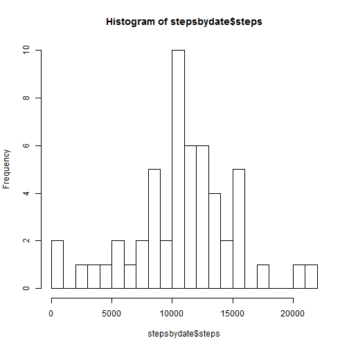
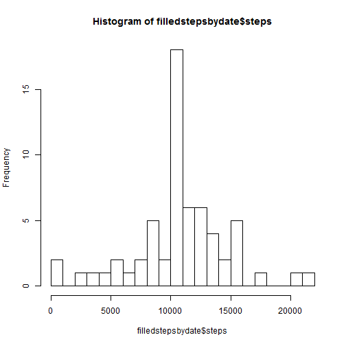
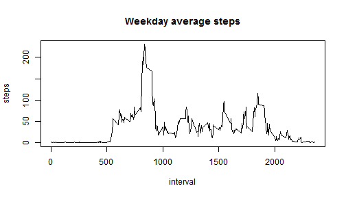

Reproducible Research: Peer Assessment 1
=========================================

## Loading and preprocessing the data


```r
activity <- read.csv('activity.csv', stringsAsFactors=FALSE)
```

## What is mean total number of steps taken per day?

```r
stepsbydate <- aggregate(steps~date,activity,sum,na.rm=TRUE)
mean(stepsbydate$steps, na.rm=TRUE)
```

```
## [1] 10766
```

```r
median(stepsbydate$steps, na.rm=TRUE)
```

```
## [1] 10765
```

```r
hist(stepsbydate$steps, breaks=20)
```

 


## What is the average daily activity pattern?

```r
stepsbyinterval <- aggregate(steps~interval,activity,mean,na.rm=TRUE)
plot(stepsbyinterval, type="l")
```

 

```r
maxSteps <- max(stepsbyinterval$steps)
maxInterval <- stepsbyinterval$interval[which.max(stepsbyinterval$steps)]
```
The interval with the largest average number of steps was 835 which had 206.1698 steps on average.

## Imputing missing values

```r
nmissing = nrow(activity) - nrow(activity[complete.cases(activity),])
```
There are 2304 missing values.

```r
imputed <- activity;
for (i in 1:nrow(activity)) {
  if(is.na(activity$steps[i])) {
    imputed$steps[i] = stepsbyinterval$steps[which(stepsbyinterval$interval == activity$interval[i])]
  }
}

filledstepsbydate <- aggregate(steps~date,imputed,sum,na.rm=TRUE)
mean(filledstepsbydate$steps, na.rm=TRUE)
```

```
## [1] 10766
```

```r
median(filledstepsbydate$steps, na.rm=TRUE)
```

```
## [1] 10766
```

```r
hist(filledstepsbydate$steps, breaks=20)
```

 
## Are there differences in activity patterns between weekdays and weekends?

```r
imputed$weekday <- weekdays(as.Date(imputed$date, "%Y-%m-%d"))
imputed$isWeekend <- (imputed$weekday == "Saturday" | imputed$weekday == "Sunday")
weekendStepsbyinterval <- aggregate(steps~interval,imputed[imputed$isWeekend == TRUE,],mean)
weekdayStepsbyinterval <- aggregate(steps~interval,imputed[imputed$isWeekend == FALSE,],mean)

qplot(interval, steps, data=imputed, geom=c("line"), xlab="Interval", ylab="Steps", main="Activity patterns weekend and weekdays", fill=isWeekend)
```

```
## Error: could not find function "qplot"
```

```r
with(weekendStepsbyinterval, plot(interval,steps,type="l", main="Weekend average steps"))
```

 

```r
with(weekdayStepsbyinterval, plot(interval,steps,type="l", main="Weekday average steps"))
```

 
