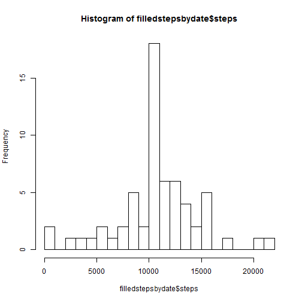
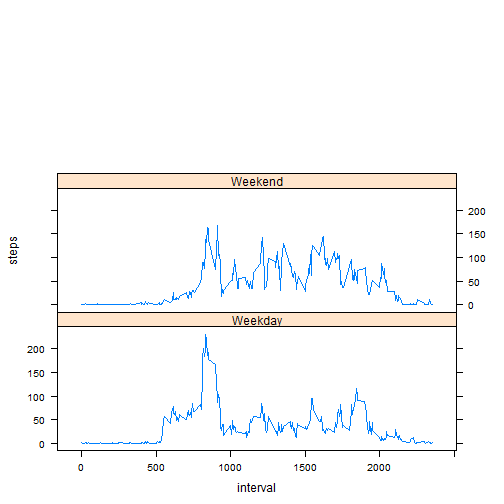

Reproducible Research: Peer Assessment 1
=========================================

## Loading and preprocessing the data
The acivity data is loaded from 

```r
activity <- read.csv('activity.csv', stringsAsFactors=FALSE)
```

## What is mean total number of steps taken per day?

```r
stepsbydate <- aggregate(steps~date,activity,sum,na.rm=TRUE)
meanSteps <- mean(stepsbydate$steps, na.rm=TRUE)
medianSteps <- median(stepsbydate$steps, na.rm=TRUE)
```
The mean number of steps is 1.0766 &times; 10<sup>4</sup>
The median number of steps is 10765

```r
hist(stepsbydate$steps, breaks=20)
```

 


## What is the average daily activity pattern?

```r
stepsbyinterval <- aggregate(steps~interval,activity,mean,na.rm=TRUE)
plot(stepsbyinterval, type="l")
```

 

```r
maxSteps <- max(stepsbyinterval$steps)
maxInterval <- stepsbyinterval$interval[which.max(stepsbyinterval$steps)]
```
The interval with the largest average number of steps was 835 which had 206.1698 steps on average.

## Imputing missing values
The missing values in the activity data will be filled using the mean value of the interval of the missing value. This value has already been calculated for each interval value, and is stored in the stepsbyinterval data. 

```r
nmissing = nrow(activity) - nrow(activity[complete.cases(activity),])
```
There are 2304 missing values.

```r
imputed <- activity;
for (i in 1:nrow(activity)) {
  if(is.na(activity$steps[i])) {
    imputed$steps[i] = stepsbyinterval$steps[which(stepsbyinterval$interval == activity$interval[i])]
  }
}

filledstepsbydate <- aggregate(steps~date,imputed,sum,na.rm=TRUE)
mean(filledstepsbydate$steps, na.rm=TRUE)
```

```
## [1] 10766
```

```r
median(filledstepsbydate$steps, na.rm=TRUE)
```

```
## [1] 10766
```

```r
hist(filledstepsbydate$steps, breaks=20)
```

 
## Are there differences in activity patterns between weekdays and weekends?

```r
imputed$weekday <- weekdays(as.Date(imputed$date, "%Y-%m-%d"))
imputed$isWeekend <- (imputed$weekday == "Saturday" | imputed$weekday == "Sunday")
weekendStepsbyinterval <- aggregate(steps~interval,imputed[imputed$isWeekend == TRUE,],mean)
weekdayStepsbyinterval <- aggregate(steps~interval,imputed[imputed$isWeekend == FALSE,],mean)

weekendStepsbyinterval$daytype="Weekend"
weekdayStepsbyinterval$daytype="Weekday"

alldays <- rbind(weekendStepsbyinterval,weekdayStepsbyinterval)
library(lattice)
with(alldays,xyplot(steps~interval|daytype,type="l",layout=c(1,3)))
```

 
